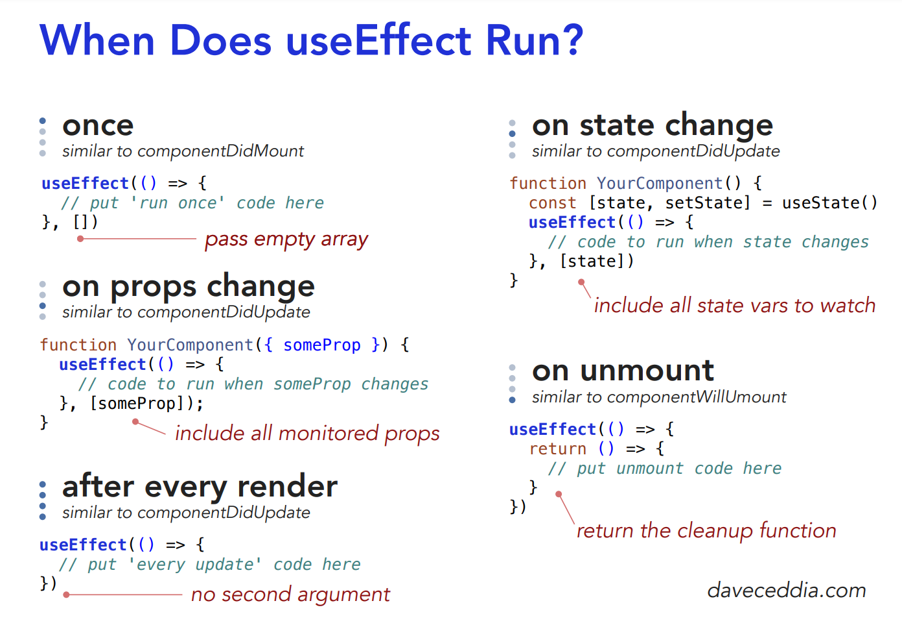

# useEffect (functional component)

Every component in react has a lifecycle (mounting, updating, unmounting)

useEffect hook was introduced to replace some of the most used lifecycle methods in class-based components (such as componentDidMount, componentDidUpdate, and componentWillUnmount)

**Definition:**

- A react hook that allows you to perform side effects in your components.

**Use case (examples of side effects):**

- fetch requests.
- manipulating DOM directly.
- using timer functions like setTimeout()

**Resources:**

- [Official react page](https://reactjs.org/docs/hooks-effect.html)
- [useEffect / w3schools](https://www.w3schools.com/react/react_useeffect.asp)
- [useEffect / blog](https://dmitripavlutin.com/react-useeffect-explanation/)
- [useEffect cleanup example (loading page)](https://dev.to/otamnitram/react-useeffect-cleanup-how-and-when-to-use-it-2hbm)

**Resources for ClassBasedComponent (CBC):**

- [lifecycle methods](https://programmingwithmosh.com/javascript/react-lifecycle-methods/)
- [lifecycle / w3schools](https://www.w3schools.com/react/react_lifecycle.asp#:~:text=Each%20component%20in%20React%20has,Mounting%2C%20Updating%2C%20and%20Unmounting.)

---
