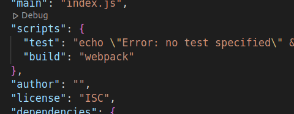

# What we learnt today

1. Back in the days when we had only the `var` keyword, we had to use functions to make sure that our variables do not get attached to the Window object due to the scope.

   To test this, try declaring a variable in one of your files, for example, `var name = 'My Name'`.

   After that, if you open the developer console and start typing window.name, you should be able to find that variable on the window object.

   We then introduced IIFE's to make sure that function names are not attached to the Window object. This helps us from running into bugs of having variables with the same name.

2. We then learned that we can add modules to our project. We do so by adding type='module' to our script inside HTML.
   ``

3. By adding the type to our script, we are now able to use `import` and `export` keywords. They are useful because our code becomes isolated and reusable and therefore easier to maintain. Find examples of imports and exports [here](./src//examples.js).

4. Now, we wanted to add an external library to our project. We wanted to add lodash.

5. To be able to add lodash to our project, we had to initialize a [package.json](./package.json) file, which helps us manage our project and its dependencies.

6. We initialize a `package.json` file by going through the terminal to our project root directory (in this case we had to go to the [Modules](./) directory) and writing the command `npm init --yes`.

7. After that, we should be able to find a package.json file in our directory.

8. So, now that we have package.json file, we wanted to add the lodash library to our project, and we did that by typing the following command in our terminal: `npm install --save lodash`

9. Up until this point, everything worked great, but now that we have introduced an external library (`lodash` in our case), we noticed that the app would crash, it could not understand what lodash is. This is because the browser does not understand how to add an external library to our project.

10. To fix this problem, we had to add `webpack` to our project. We wanted to add it as a developer dependency, since we do not want the user to download it.

11. We did so by typing the following command in the terminal: `npm install --save-dev webpack webpack-cli`

12. OK, great. So we have lodash and webpack install, now we only need to build our project using webpack. Webpack will take a look at all our modules and the libraries that we installed, and make one big javascript file that the browser can understand.

13. To build the project using webpack, we need to do two things:

    1. Inside our [package.json](./package.json),
       we need to add a new script. Under the `script` namespace, we add a build script: `"build": "webpack"`.

       

    2. Now in our terminal, we can run the following command: `npm run build`

14. Inside our [Modules](./) directory, there should now be a new directory called [dist](./dist/). Inside of it, we can find a file name [main.js](./dist/main.js). If you open it, you will notice human unreadable javascript. That is the file that the browser needs to understand the dependencies between your modules and external libraries.

15. So now, all we need to do is, inside of our [index.html](index.html), replace the old script tag with the new one. We want to use:
    `` instead of ` `

16. Voila, lodash and our app should be finally working together.
