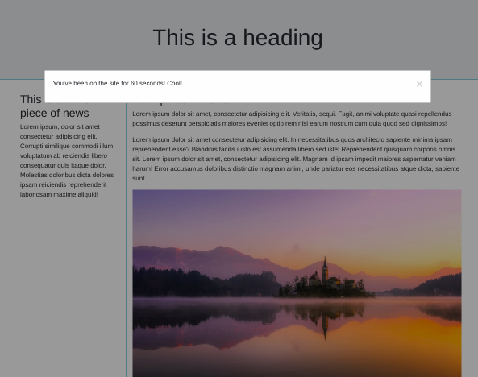

# Promise me a modal

**Instructions**
- Create a promise that, once resolved, displays a modal to the user after the user spends 60seconds on the page
- Investigate `index.html` and `main.scss`, but you don't actually have to edit them
- Add your JavaScript to index.js
- Tested with Node version 17
- Hint: Read all output from the terminal :)
- Do not use Live server

- **BONUS** The user should be able to close the modal somehow :)
